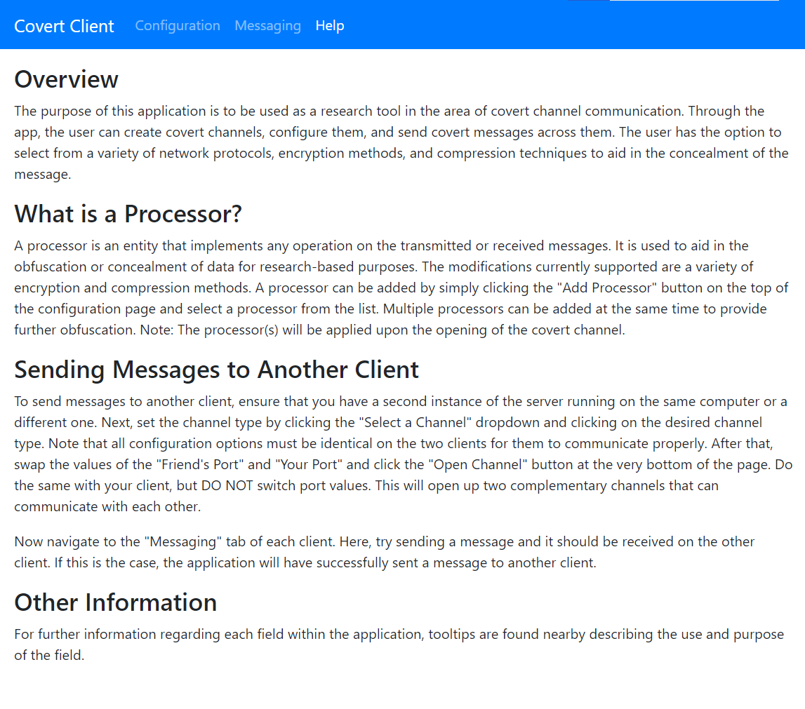

A Toolkit for Constructing Covert Channels
==============

- [Background](#background)
- [System Functionality](#system-functionality)
- [Installation / First-Time Setup](#installation--first-time-setup)
  * [System Requirements](#system-requirements)
  * [Dependencies](#dependencies)
  * [Building the Application](#building-the-application)
  * [Running the Application](#running-the-application)
  * [Verifying the Application Works](#verifying-the-application-works)
- [Help Page](#help-page)

# Background
A covert channel is a messaging system that sends messages in a manner that attempts to prevent outside observers from realising the existence or nature of the communication. The system allows users to select from a set of covert channel implementations, configure the channels, and exchange messages with a peer user via said channel.

The system is designed to help researchers investigate the nature of covert channel communication, allowing them to investigate detection methods for covert channels as well as the feasibility of sending messages in a covert manner.

The purpose of the system is to be used as a research tool in the area of covert channel communication. To do so we have constructed a system that implements a set of covert channels that a user can select and configure for transmitting covert information over computer networks. These coverts channels will be implemented using a variety of common internet protocols to help obscure covert messages within normal traffic. This will be accomplished by burying information alongside modifying the existing information within the data packets. The packet will then be reassembled on the receiver side to display the covert message.

# System Functionality
The user will interact with the system through a web application interface in which they will be able to interact with the covert channels. The user can create covert channels, configure them, and send covert messages across them. The user has the option to select from a variety of network protocols, encryption methods, and compression techniques to aid in the concealment of the message. Upon inputting this information through the web application front end, it will then be communicated to the back end program that handles the network connections and logic of the system. The information will then be communicated across to another computer running the system. These user interactions with the system will be detailed in the following sections.

# Installation / First-Time Setup
A video demonstrating the setup process is available coming soon!

## System Requirements
* This application runs on a Linux OS. It has been tested on Ubuntu 18 LTS, but is likely to work on other up-to-date Linux distributions.
* It may work on Mac OS, but this is untested.
* It will not work on Windows. This can be bypassed by using the Windows Subsytem for Linux (WSL) V2+, but this is not a recommended approach unless you are already highly familiar with it.
* A virtual machine will **not** work.

## Dependencies
The following applications must be installed on the system. For setup instructions using Ubuntu 18, refer to the video linked below.
* Node.JS version 12+
* GoLang version 1.13+

Using Ubuntu, the commands to install those would be as follows.
```
wget -qO- https://raw.githubusercontent.com/nvm-sh/nvm/v0.35.2/install.sh | bash
nvm install node
wget https://dl.google.com/go/go1.13.linux-amd64.tar.gz
sudo tar -C /usr/local -xzf go1.13.linux-amd64.tar.gz
echo 'export PATH=$PATH:/usr/local/go/bin' >> ~/.bash_profile
```

Verify these are installed and are the correct versions with the following commands:
```
nodejs -v
go version
```

## Building the Application
First, clone this repository to anywhere on your system. 
```
git clone https://github.com/TaylorAbraham/Covert-Channels.git
```

Open a terminal and navigate to the directory of this readme.
```
cd Covert-Channels/go\_covert\_lib/
```

Install go dependencies.
```
go get github.com/google/gopacket github.com/gorilla/websocket golang.org/x/net/ipv4
```

Now, build the server:
```
go build main.go
```

Lastly, build the client.
```
cd client
npm install
npm run build
cd ..
```

## Running the Application
The server can be started through `sudo ./main -p <PORT>`. The -p flag is used to specify which port the server will run on. Note that superuser privilege (sudo) is required to run the application. An example of starting a server on port 8080 is as follows:
```
sudo ./main -p 8080
```

Open a browser tab and navigate to localhost:8080 (or the port you chose). The client will automatically connect to the server running at that port, and the web interface of the application will be displayed.

## Verifying the Application Works
For a simple verification of functionality, open another terminal and launch a second server at port 8081. In another tab of your browser, navigate to localhost:8081. In this tab, set the channel type to "TCPSyn". Next, swap the values of the "Friend's Port" and "Your Port" and click the "Open Channel" button at the very bottom of the page. Do the same with your client opened on localhost:8080, but DO NOT switch port values. This will open up two complimentary channels which can communicate to each other.

Now navigate to the "Messaging" tab of each client. Here, try sending a message and it should be received on the other client. If this is the case, the application is successfully producing covert communication!

# Help Page
The help page in the application displays more information on the application as well as some simple usage instructions.

